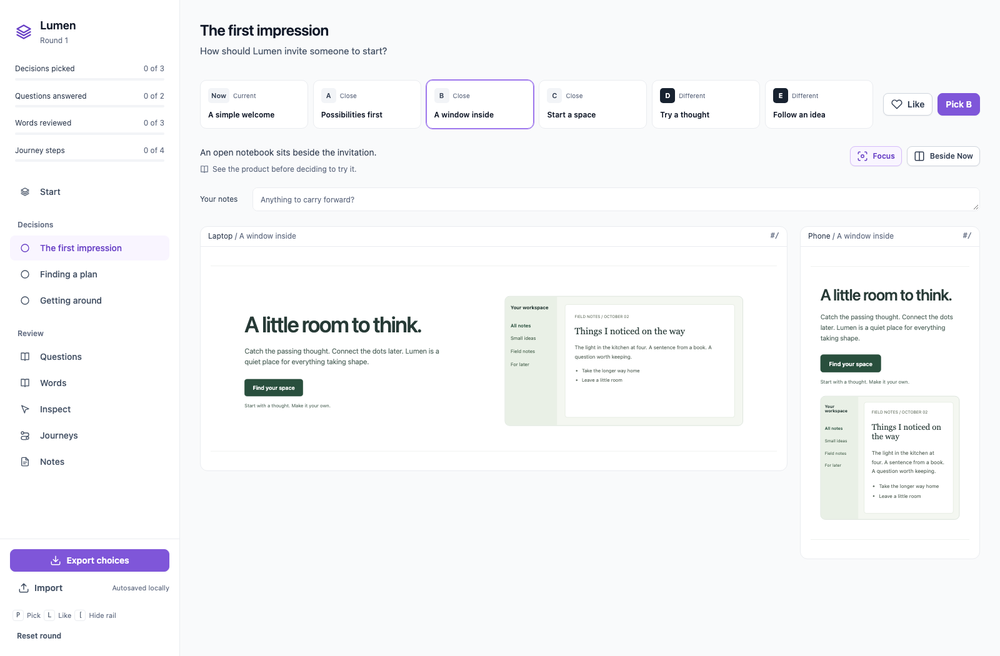

# optionlab

**Real design options. Your app. One file of choices.**

Your coding agent builds alternatives for a header, a plan table, a first impression.
You open one HTML file, try the real pages, compare beside the current design, like,
pick and leave notes. Export one JSON file. The agent makes your picks canonical.

<details>
<summary>Why a live lab?</summary>

**Why not Storybook?** It presents isolated components. Optionlab frames your real pages and records a choice.

**Why not screenshots?** Frames are interactive and responsive. Screenshots verify options, not replace them.

**Does it work with my framework?** Yes. A variant is a CSS attribute or one function call.

**Do I ship the client?** No. It is development-only and removed when the rounds end.

</details>

## Installation

This is an **unpublished preview**. Node 20+ is enough to build; the reviewer installs nothing.

```sh
git clone https://github.com/gugarosa/optionlab.git
cd optionlab
```

## Quick start

```sh
node bin/optionlab.js build examples/lumen/optionlab.json --open
```

Lumen is a fictional note-taking product with three decisions,
13 options, questions, vocabulary, an inspector and a four-step journey. Everything works offline.
After building, `lab.html` can move anywhere and open by double-clicking.

### Use in your app

Install this preview explicitly, then give your agent the [skill](skill/SKILL.md):

```sh
npm install --save-dev github:gugarosa/optionlab
npx optionlab init
npx optionlab skill
```

Ask the agent to propose several real options per decision, implement them in your app,
and describe the round in `optionlab/optionlab.json`. Now is unchanged; A-C are close
variations, D-E explore different answers. Use fewer when the decision is small.

```sh
npx optionlab build --open
npx optionlab check --shots optionlab/shots
```

Do not hand off a broken round. Check every option, then send the reviewer `lab.html`.
Live URLs need your existing dev server; local HTML sources do not.

## Write a variant

Copy `node_modules/optionlab/client/optionlab.js` into your app's public directory.
Load it **before app scripts, in development only**:

```html
<script src="/optionlab.js"></script>
<style>
  html[data-ol-header="b"] .site-header {
    padding-block: 24px;
  }
</style>
```

React, Vue and Svelte need no adapter. In the development entry:

```js
import "optionlab/client";
const header = window.optionlab?.choice("header") ?? "now";
const menu = window.optionlab?.state.menu ?? "closed";
```

`optionlab.is("header", "b")` is a boolean shortcut. Outside a lab frame the client
only resolves choices; it does not add inspection UI or intercept events.
Use `?ol.header=b&ol.state.menu=open` to inspect a variant in a normal tab.

## One manifest

See [Lumen's complete manifest](examples/lumen/optionlab.json) and the
[editor schema](schema/optionlab.schema.json). Validation reports the exact field to fix.

| Field                     | Purpose                                                                     |
| ------------------------- | --------------------------------------------------------------------------- |
| `title`, `round`, `about` | Name, positive round number and a short introduction                        |
| `base`                    | An absolute HTTP(S) base for live relative URLs                             |
| `devices`                 | Named `[width, height]` pairs; laptop 1440x900 and phone 390x844 by default |
| `defaults`                | Settled decision-to-option mappings from earlier rounds                     |
| `decisions`               | Independent questions, each with views and 1-6 proposals besides `now`      |
| `views`                   | Caption, device, exactly one `url` or `file`, optional `focus` and `state`  |
| `options`                 | ID, name, idea; optional close/different kind, why and tradeoff             |
| `questions`, `words`      | Answers and vocabulary choices, optionally grouped                          |
| `elements`, `inspect`     | Named selectors and routes for point-and-click feedback                     |
| `journeys`                | Ordered routes, target selectors, descriptions and questions                |

IDs use lowercase letters, numbers and hyphens and are unique in their list.
The lab adds `now` when omitted. Optional pages appear only when defined.
Review-only rounds may have no decisions. Without explicit inspect routes, registered
elements can be reviewed using the first view of each decision.

Local sources use `"file": "mockups/hero-{option}.html#/pricing"`. The build deduplicates
files, injects the client and a `base` element, and embeds their contents as `srcdoc`.
**Inline assets or use absolute URLs.** Relative assets cannot travel with the lab.
For an offline round, inline everything. Use hash routing: `pushState`/`replaceState`
are not supported inside `srcdoc`. Local previews are sandboxed; scripts and forms work,
but parent access, popups, downloads and browser storage are intentionally unavailable.

Live pages are not rewritten or proxied. They must include the client, permit framing,
and allow its development-only styles. `window.name` carries choices before app scripts
run and across in-frame navigation; query parameters are the debug channel.
Precedence is name, query, then `now`. Frames combine defaults, your picks, and the active option.

## Review and hand back

The rail tracks progress. Decision tabs offer Like, Pick, Focus/Full page and Beside Now.
Inspect selects registered elements, then explicit `data-ol-name` labels, then readable
role/name fallbacks. Previous/Next walks instances without triggering the page's actions.
Journeys highlight each target at laptop or phone size.

Changes autosave under `optionlab:<title>:r<round>`. Export
`optionlab-choices-r<round>.json`; import can restore it and warns about a different title or round.
Storage availability varies for files and private browsing: **export before handing off**.
Reset round has an inline confirmation.

| Keys         | Action                              |
| ------------ | ----------------------------------- |
| Up / Down    | Previous / next page                |
| Left / Right | Previous / next option              |
| P / L        | Pick / like                         |
| B / F        | Beside Now / focus or full page     |
| I / [ / Esc  | Inspect / toggle navigation / close |

Shortcuts do not run while typing. Every page has a shareable hash, such as `#/d/header/b`.

The [choices schema](schema/choices.schema.json) records picks, likes, notes, question
answers, words, element feedback and journey verdicts. `pick: null` is undecided;
`pick: "now"` means keep current. Element `index` distinguishes repeated instances.
Picks are decisions, likes inform refinement, and notes are requirements. The agent
applies settled picks, carries unresolved ones into the next round, then removes the
client and all variant scaffolding.

## Commands and API

| Command                                         | Result                                                       |
| ----------------------------------------------- | ------------------------------------------------------------ |
| `init [dir]`                                    | Starter manifest and a lab ignore rule; default `optionlab/` |
| `build [manifest] [-o file] [--watch] [--open]` | One HTML file, beside the manifest by default                |
| `check [manifest] [--shots dir]`                | Browser verification and optional PNGs                       |
| `skill [dir]`                                   | Copy the agent skill; default `.github/skills/optionlab`     |

Lookup checks `optionlab/optionlab.json`, then `./optionlab.json`. Init and skill never
overwrite existing files. For Claude Code, use `skill .claude/skills/optionlab`;
for a user-level Copilot install, use `skill ~/.copilot/skills/optionlab`.

Check needs optional Playwright: `npm i -D playwright && npx playwright install chromium`.
It resolves your project's Playwright first, then this package's; `playwright-core`
can use installed Chrome. It checks runtime/network errors, readiness, empty pages,
phone overflow, missing selectors and byte-identical-to-Now screenshots, then visits
every lab page. Missing registered elements warn. Failures exit 1.
Shots are named `<decision>-<option>-<view-number>.png`.

The ESM API exports `build(path?, { output? })`, `check(path?, { shots?, log? })`
and `loadManifest(path?)`. Build returns output, normalized manifest, bundled data,
dependencies and counts. Check returns failures, warnings, frame count and problems.
Load returns `{ manifest, path }`. There are **zero runtime dependencies**.

## Documentation

- [Conventions](CONVENTIONS.md)
- [Architecture](docs/architecture.md)
- [Agent workflow](skill/SKILL.md)

## Tests

```sh
npm ci
npm run verify
npx playwright install chromium
npm run verify:browser
```

See [AGENTS.md](AGENTS.md) for focused tests, browser selection and screenshot refreshes.

MIT. Lucide icons use ISC; Feather-derived paths retain their MIT notice in `shell/icons.js`.
